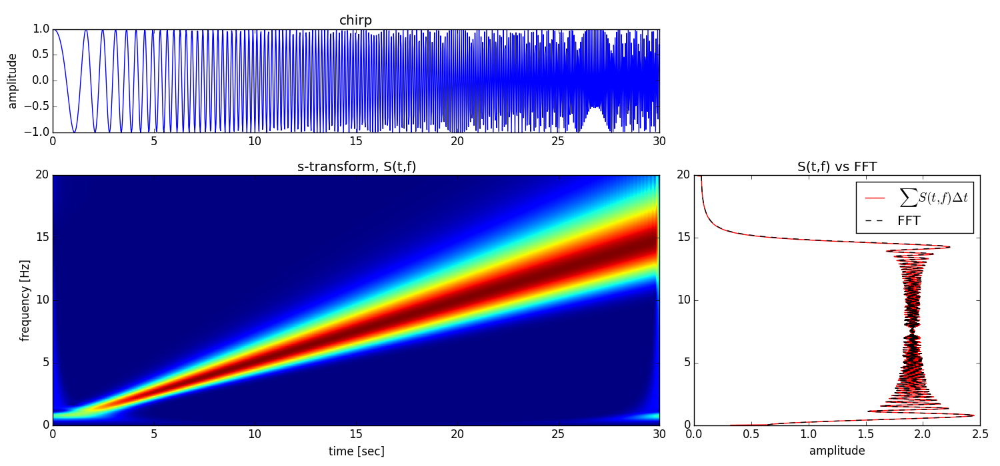

# Stockwell Transform

The Stockwell transform, and its inverse, implemented in C and NumPy.


All credit goes to the authors (not me).  Please see LICENSE.txt.


## Example

Transform a chirp.

```python
import numpy as np
from scipy.signal import chirp
from stockwell import stransform

sample_rate = 40.0  #[Hz]
total_sec = 30.0

# make a linear chirp
t = np.arange(0.,total_sec,1./sample_rate)
c = chirp(t, 0.2, 20.0, 10.0, method='linear', phi=0, vertex_zero=True)

S, T, F = stransform(c, Fs=sample_rate)

```

Plotting is easy.

```python
plt.pcolormesh(T, F, abs(S))

```

Let's plot something nicer, though.

```python
N = len(c)
C = np.abs(np.fft.fft(c, N) * sample_rate)[:N/2 + 1] * 2.0/N
df = 1.0 / (N/sample_rate)
f = df * np.arange(len(C))
dt = 1.0 / sample_rate

fig = plt.figure(figsize=(15,7))

ax1 = plt.subplot2grid((3, 3), (0, 0), colspan=2)
ax1.plot(t, c)
ax1.set_title('chirp')
ax1.set_ylabel('amplitude')

ax2 = plt.subplot2grid((3, 3), (1, 0), colspan=2, rowspan=2)
ax2.pcolormesh(T, F, abs(S))
ax2.set_title('s-transform, S(t,f)')
ax2.set_xlabel('time [sec]')
ax2.set_ylabel('frequency [Hz]')

ax3 = plt.subplot2grid((3, 3), (1, 2), rowspan=2)
ax3.plot(abs(S.sum(axis=1))/(t[-1] - t[0]), F[:,0], 'r', label=r'$\sum (S(t,f) \Delta t$')
ax3.plot(C, f, '--k', label='FFT')
ax3.set_title('S(t,f) vs FFT')
ax3.set_xlabel('amplitude')
plt.legend()

plt.tight_layout()
plt.draw()

``` 




## Installation


...should hopefully be easy.

```bash
python setup.py install
```
