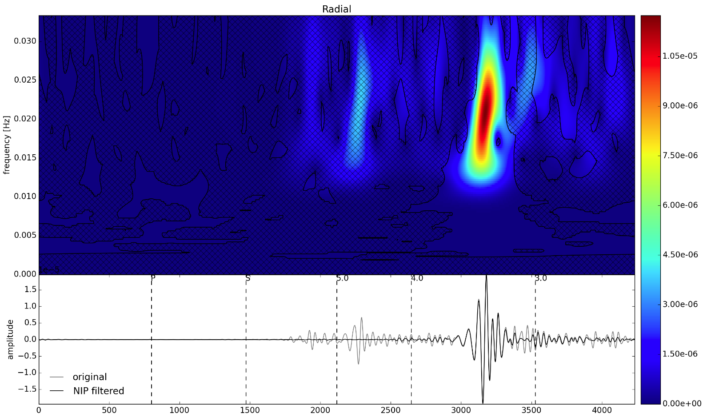

# Advanced Filtering

One of the benefits of the Stockwell transform as apposed to wavelet transforms
is that it directly preserves phase in the same way that a Fourier transform
does, which makes filters based upon phase relationships possible in
time-frequency space.  In the example below, we use the Normalized Inner
Produce filter of [Meza-Fajardo et al., (2015)] to pass retrograde Rayleigh waves
(in any frequency) from a particular azimuth.


```python
from obspy import read

st = read("tests/data/mdj-ic-00-lh[rtz]-2010-01-10-00-27.sac", format='SAC')

rs = st.select(component='R')[0].data
ts = st.select(component='T')[0].data
v = st.select(component='Z')[0].data

tr = st[0]
fs = tr.stats.sampling_rate

```

## Subheading





[Meza-Fajardo et al., (2015)]: http://www.bssaonline.org/content/105/1/210.abstract

