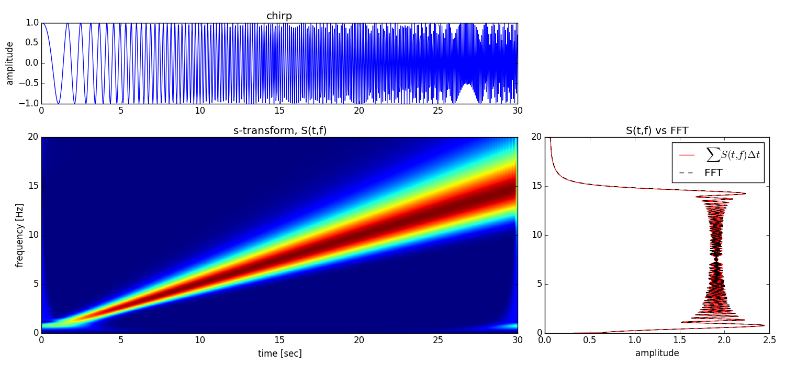

### Plotting

Plotting a transform is easy using Matplotlib's `pcolormesh`.  We'll use our
chirp example from earlier.

```python
plt.pcolormesh(T, F, abs(S))

```

Let's plot something nicer, though.

```python
N = len(c)
C = np.abs(np.fft.fft(c, N) * sample_rate)[:N/2 + 1] * 2.0/N
df = 1.0 / (N/sample_rate)
f = df * np.arange(len(C))
dt = 1.0 / sample_rate

fig = plt.figure(figsize=(15,7))

ax1 = plt.subplot2grid((3, 3), (0, 0), colspan=2)
ax1.plot(t, c)
ax1.set_title('chirp')
ax1.set_ylabel('amplitude')

ax2 = plt.subplot2grid((3, 3), (1, 0), colspan=2, rowspan=2)
ax2.pcolormesh(T, F, abs(S))
ax2.set_title('s-transform, S(t,f)')
ax2.set_xlabel('time [sec]')
ax2.set_ylabel('frequency [Hz]')

ax3 = plt.subplot2grid((3, 3), (1, 2), rowspan=2)
ax3.plot(abs(S.sum(axis=1))/(t[-1] - t[0]), F[:,0], 'r', label=r'$\sum S(t,f) \Delta t$')
ax3.plot(C, f, '--k', label='FFT')
ax3.set_title('S(t,f) vs FFT')
ax3.set_xlabel('amplitude')
plt.legend()

plt.tight_layout()
plt.draw()

``` 




### Filter Plotting

This example makes plots of advanced NIP-filtered seismic data.  Please see
the [filtering section](filtering.md) to read about advanced filtering using
the Normalized Inner Product of S-transforms.
